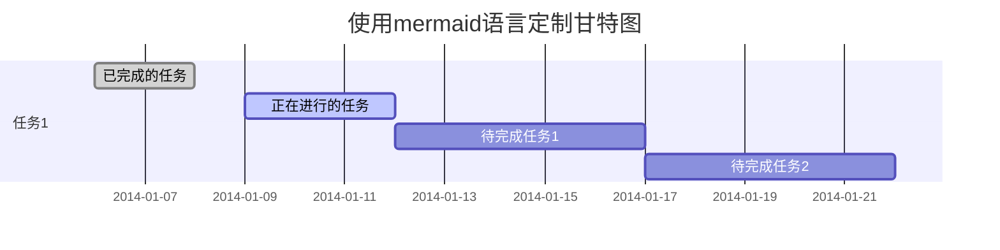
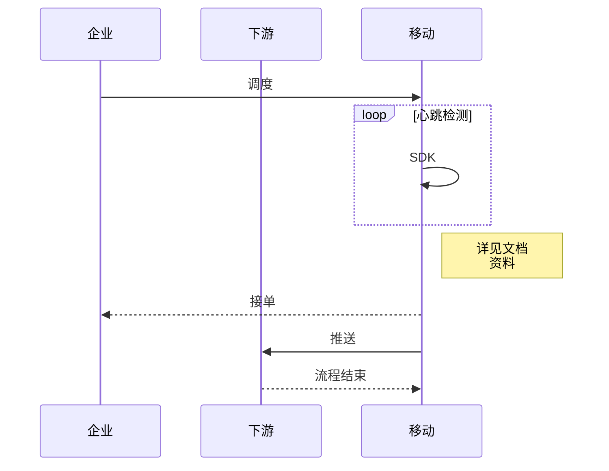
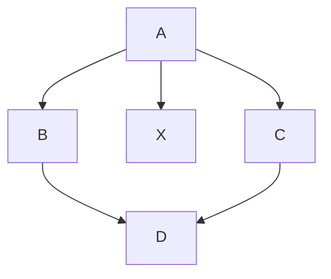
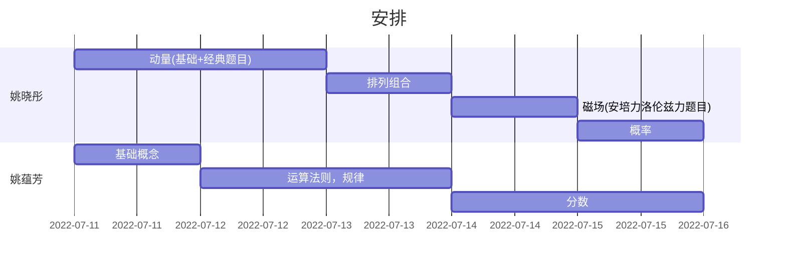

# 这是个一级标题

## 目录

[TOC]

## 可以试试的

第一次尝试markdown

```C++
std::cout<<a<<"asd";
```

- [ ] the first one
- [x] the second one
$$
\sum_{i=1}^{n}{a_i+1}
$$
$$
\int_{x}^{y}\int_x^y\cos(xy)dxdy
$$
其实也可以
一个段落









