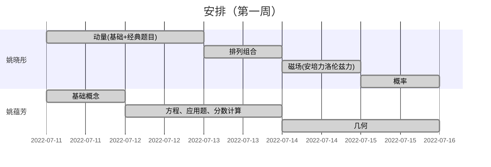
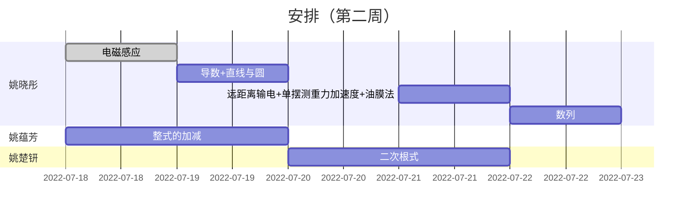

# 补课安排

## 第一周

```mermaid
gantt
    title 安排（第一周）
    dateFormat YY-MM-DD
    section 姚晓彤
        动量(基础+经典题目):done,des11,22-07-11,2d
        排列组合:done,des12,22-07-13,1d
        磁场(安培力洛伦兹力):done,des13,22-07-14,1d
        概率:done,des14,22-07-15,1d
    section 姚蕴芳
        基础概念:done,des21,22-07-11,1d
        方程、应用题、分数计算:done,des22,22-07-12,2d
        几何:done,des23,22-07-14,2d
    section 姚楚钘
    section 张曦予
```

## 第二周

```mermaid
gantt
    title 安排（第二周）
    dateFormat YY-MM-DD
    section 姚晓彤
        电磁感应:done,des11,22-07-18,1d
        导数+直线与圆:des12,22-07-19,1d
        远距离输电+单摆测重力加速度+油膜法:des12,22-07-21,1d
        数列:des14,22-07-22,1d
    section 姚蕴芳
        整式的加减:des21,22-07-18,2d
    section 姚楚钘
        二次根式:des31,22-07-20,2d
    section 张曦予
```
