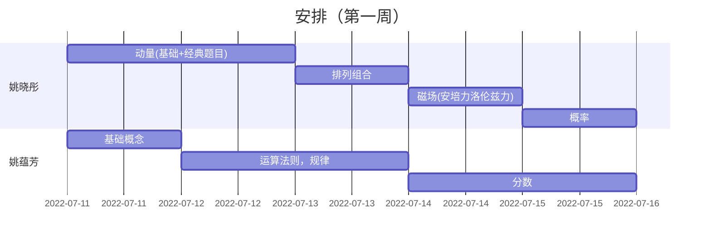
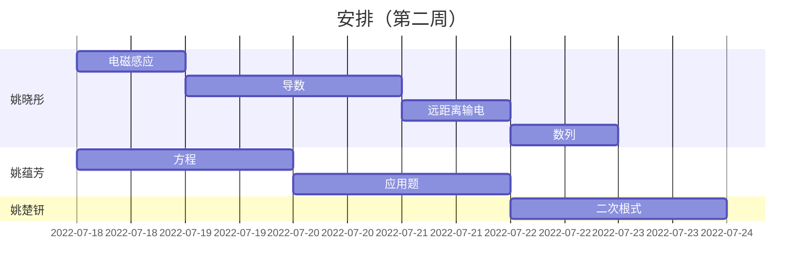

# 补课安排

## 第一周

```mermaid
gantt
    title 安排（第一周）
    dateFormat YYYY-MM-DD
    section 姚晓彤
        动量(基础+经典题目):des11,2022-07-11,2d
        排列组合:des12,2022-07-13,1d
        磁场(安培力洛伦兹力):des13,2022-07-14,1d
        概率:des14,2022-07-15,1d
    section 姚蕴芳
        基础概念:des21,2022-07-11,1d
        运算法则，规律:des22,2022-07-12,2d
        分数:des23,after des22,2d
    section 姚楚钘
    section 张曦予
```

## 第二周

```mermaid
gantt
    title 安排（第二周）
    dateFormat YYYY-MM-DD
    section 姚晓彤
        电磁感应:des11,2022-07-18,1d
        导数:des12,2022-07-19,2d
        远距离输电:des12,2022-07-21,1d
        数列:des14,2022-07-22,1d
    section 姚蕴芳
        方程:des21,2022-07-18,2d
        应用题:des22,2022-07-20,2d
    section 姚楚钘
            二次根式:des31,2022-07-22,2d
    section 张曦予
```
